# Doxen - BRD Generator

AI-powered Business Requirements Document generator that transforms scattered communications into professional, structured documentation.

## What is Doxen?

Doxen automatically converts emails, Slack messages, meeting transcripts, and documents into comprehensive Business Requirements Documents (BRDs) — saving hours of manual work while improving accuracy and traceability. 

## ✨ Key Features

- **Seamless Multi-Source Integration** - Direct integration with specified Slack channels and Gmail to automatically pull relevant communications without manual copy-pasting.
- **One-Click OAuth Sign-In** - Fast, secure, and direct login utilizing OAuth authentication.
- **Sleek, Responsive UI/UX** - A completely revamped, fast, and smooth interface that works perfectly across multiple devices (desktop, tablet, and mobile).
- **Intuitive Dashboard** - Simplified navigation across all components and features, allowing you to manage sources and documents effortlessly.
- **AI-Powered Extraction** - Automatically identifies and categorizes functional & non-functional requirements from the noise of daily communication.
- **Complete Traceability** - Every requirement is linked back to its original source with confidence scores.
- **Manual & Natural Language Refinement** - Take control of your document by manually refining the generated BRD using simple natural language commands (e.g., "Add a security section" or "Make the login requirements more detailed").
- **Professional Output** - Export your finalized documents as PDFs or Markdown with a standardized, industry-ready BRD structure.
- **Version Control** - Track all document iterations automatically.

## 🗺️ Navigation Links

- **[Documents Folder](Documents)** - All the Essential documents for this product like the DFD,UFD,SRS.
- **[Datasets Folder](Dataset)** - Dataset Used for Testing the Agent's Working.

## 🧭 First-Time User Navigation Guide

Welcome to Doxen! Here is the step-by-step flow you will experience as a first-time user:

1. **Landing Page & Authentication**: Start at our landing page and proceed through the authentication flow.
2. **Username Setup**: As a first-time user, you will be prompted to set up your unique username.
3. **Dashboard & Workspace**: Enter your main Dashboard and open a new Project Workspace.
4. **Add Data Sources**: Input your data by uploading documents, pasting transcripts, or syncing your integrated apps.
5. **Extract Requirements**: The AI will process your sources to extract and structure the necessary requirements.
6. **Generate BRD**: Doxen will automatically generate your drafted Business Requirements Document.
7. **Refine BRD**: Review the draft and choose to manually refine the BRD if adjustments are needed.
8. **Export**: Export your finalized file. Your polished document is now delivered!

## 🛠️ Tech Stack

- **Frontend:** React 18, TypeScript, Tailwind CSS, shadcn/ui
- **Backend:** Supabase (OAuth, PostgreSQL, Storage, Edge Functions)
- **AI:** Lovable AI Gateway (Gemini Flash) or OpenAI/Google AI
- **Integrations:** Slack Web API, Gmail API

## 📈 Example Use Case

**Before Doxen:** 8-12 hours manually reading through 50+ Slack messages, 10 emails, and 3 meeting transcripts to create a single BRD.

**After Doxen:** 15 minutes to sync Slack and Gmail, extract requirements, manually refine the draft using natural language, and generate a professional BRD with full source traceability.

## 🚧 Project Status

**In Development** - 90% completed all essential features working!!.

## � User Navigation Flowchart

Here's a visual flowchart of the first-time user journey through Doxen:

```mermaid
flowchart TD
    A["🚀 Start at Landing Page"] --> B["🔐 Authentication Flow"]
    B --> C["👤 Set Up Username"]
    C --> D["📊 Enter Dashboard & Open Project Workspace"]
    D --> E["📁 Add Data Sources"]
    E["📁 Add Data Sources<br/>Upload Documents | Paste Transcripts | Sync Apps"] --> F["⚙️ AI Processes Sources"]
    F --> G["🔍 Extract Requirements"]
    G --> H["📝 Generate Draft BRD"]
    H --> I{"✏️ Refine BRD?"}
    I -->|Yes| J["🛠️ Manually Refine using<br/>Natural Language"]
    J --> K["📥 Export Document"]
    I -->|No| K
    K --> L["✅ Final BRD Delivered<br/>PDF or Markdown Export"]
    L --> M["🎉 Complete"]
    
    style A fill:#4f46e5,stroke:#312e81,color:#fff
    style B fill:#6366f1,stroke:#312e81,color:#fff
    style C fill:#7c3aed,stroke:#5b21b6,color:#fff
    style D fill:#8b5cf6,stroke:#6d28d9,color:#fff
    style E fill:#a78bfa,stroke:#7c3aed,color:#fff
    style F fill:#a78bfa,stroke:#7c3aed,color:#fff
    style G fill:#8b5cf6,stroke:#6d28d9,color:#fff
    style H fill:#7c3aed,stroke:#5b21b6,color:#fff
    style I fill:#d97706,stroke:#92400e,color:#fff
    style J fill:#f97316,stroke:#c2410c,color:#fff
    style K fill:#06b6d4,stroke:#0e7490,color:#fff
    style L fill:#10b981,stroke:#065f46,color:#fff
    style M fill:#059669,stroke:#065f46,color:#fff
```

**Key Decision Point:** At step 7, users can choose to manually refine their BRD using natural language commands before exporting, or proceed directly to export if the generated document meets their requirements.

## �📄 License

MIT License - see the `LICENSE` file for details.

## 📬 Contact

For questions, feedback, or collaboration, reach out at:
* [sarwanupadhyay19@gmail.com](mailto:sarwanupadhyay19@gmail.com) 
* [borasarthak275@gmail.com](mailto:borasarthak275@gmail.com)
